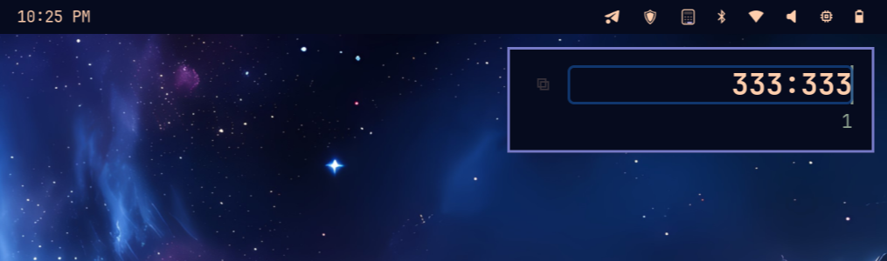

# OmaCalc

A minimal tray calculator for [Omarchy](https://omarchy.com). Lives in your system tray, pops up when you need it, disappears when you don't.



## Features

- **Tray icon** — SNI-based, themed to match your desktop
- **Live evaluation** — results appear as you type
- **Thousand separators** — auto-formatted input and output
- **Theme sync** — picks up Omarchy theme changes automatically
- **Layer shell** — renders above windows, anchored top-right
- **Copy to clipboard** — click the copy icon or press Enter
- **Keyboard driven** — Escape to dismiss, Enter to promote result

## Dependencies

- Python 3
- GTK 4
- gtk4-layer-shell
- python-dbus
- Hyprland (for layer shell + border rounding)

## Install

```bash
# Arch
sudo pacman -S gtk4-layer-shell python-gobject python-dbus

# Run
./omacalc.py

# Start on login
./omacalc.py --install
```

## Usage

Click the tray icon to toggle the calculator. Type any math expression — results update live. Press Enter to copy the result and replace the input. Press Escape to hide.

Supports: `+` `-` `*` `/` `%` `^` parentheses, implicit multiplication (`2(3+1)`), and division with `:`.

## License

MIT
